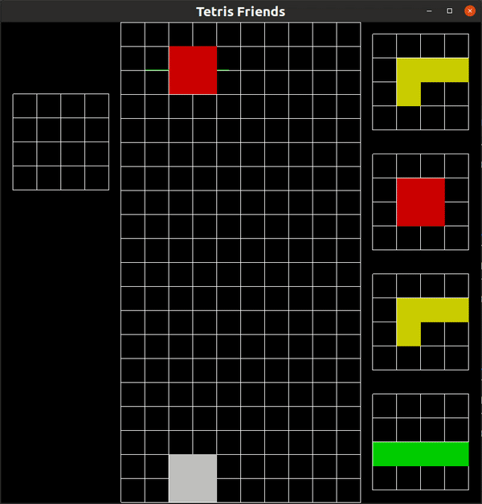

# Tetris Friends

Fully-featured Tetris Friends clone written in OpenGL/C++ using GLFW.

## Demo



## Setting up

First, build GLFW by running ```mkdir build; cd build; cmake ..``` in the Linux terminal. Play the game by running ```make; ./TetrisFriends``` or ```./run.sh``` for pre-built Makefile.

## How to play
The left panel displays the held piece and the right 4 panels display the next pieces.
- Special keys
  - 'p': pause
  - 'r': restart
  - 'q' or 'ESC': quit
  - 'Space': hard-drop a piece, dropping it instantly
  - 'Shift': hold current piece.
- Movements
  - Up key: rotate piece
  - Left/right keys: horizontal movement
  - Down key: downward acceleration
- **Note: Speed & score increases with each line clear!**
